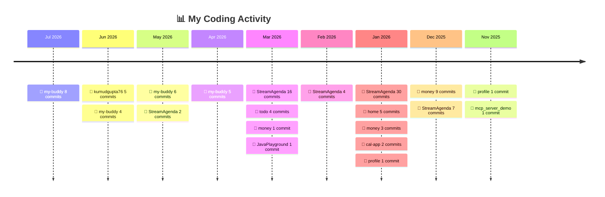

<h1 align="center">Hi there 👋 I'm Kumud Gupta</h1>
<h3 align="center">A passionate software developer • building in public</h3>

  
  

---

## 🧭 About Me

- 🔭 I'm currently **building & shipping projects in public**
- 🌱 I'm currently learning **Cloud Computing Technologies**
- ⚡ I log my work below as a running **project timeline / dev journal**
- 💬 Ask me about **ANYTHING ✌️**
- 📫 Reach me at **kumudgupta76@gmail.com**

---

## 🗓️ Project Timeline / Dev Log

> A running log of what I'm building, learning, and shipping. Newest first.

## 🟩 Contribution Calendar

  

  

### 📌 2026

<!-- TIMELINE:START -->

> 🔥 **115 commits** across **10 repos** in the last 12 months.

📜 Activity by project

- **[my-buddy](https://github.com/kumudgupta76/my-buddy)** — _last active 12 Jul 2026_  ·  🚀 23 commits
  - [`c2d6173`](https://github.com/kumudgupta76/my-buddy/commit/c2d6173d7ae03556a3f323e3a72d1b24ee2a9309) Remove CI env debug step now that OMDB key is confirmed in build
  - [`897a752`](https://github.com/kumudgupta76/my-buddy/commit/897a752ce85608b164772307c648596230af3fe5) Add debug step to verify OMDB/Firebase env presence in CI build
  - [`5fe80cb`](https://github.com/kumudgupta76/my-buddy/commit/5fe80cb38b0312d4f89ac6f8d75f8c788d2907ea) Add REACT_APP_OMDB_API_KEY to deploy build env so OMDB search works on GitHub Pages
  - [`00bd691`](https://github.com/kumudgupta76/my-buddy/commit/00bd6913f408f720e531f51d359d126933b2a68c) Add divider between collage settings sections via CSS; revert collage-section-hr approach
  - [`58cb027`](https://github.com/kumudgupta76/my-buddy/commit/58cb0272a561895747b54d706db7dcdebdfff869) Use collage-section-hr dividers in Names, Caption, and Background tabs
  - [`242d7ed`](https://github.com/kumudgupta76/my-buddy/commit/242d7edb4bfc5d7c0e19997640444c0bb71c7d73) Increment collage counter on each Create collage and persist to localStorage
  - …and 17 more commits
- **[kumudgupta76](https://github.com/kumudgupta76/kumudgupta76)** — _last active 6 Jun 2026_  ·  🚀 5 commits
  - [`d3f33f4`](https://github.com/kumudgupta76/kumudgupta76/commit/d3f33f41990426ba31fac31804e16250c7060bb8) Add Contribution Calander
  - [`c4f5faf`](https://github.com/kumudgupta76/kumudgupta76/commit/c4f5faf37eadc22fb7aa602e18875e602e1e6958) Make timeline
  - [`e768df3`](https://github.com/kumudgupta76/kumudgupta76/commit/e768df3b8cdfc73ff6a26971bd97e533f45a3cec) Add Commit Message to Timeline
  - [`ee9afcc`](https://github.com/kumudgupta76/kumudgupta76/commit/ee9afccd1f1e91fac0ad042b46df84b7e4b3c0b1) Fix Timeline issue
  - [`2c054af`](https://github.com/kumudgupta76/kumudgupta76/commit/2c054afb84eef8f4e98072bf47b6e561b3b1e7a7) Upgrade Profile Repo
- **[StreamAgenda](https://github.com/kumudgupta76/StreamAgenda)** — _last active 8 May 2026_  ·  🚀 59 commits
  - [`5b08665`](https://github.com/kumudgupta76/StreamAgenda/commit/5b086654d2a3c8ce104813986e8e4456ffdb0081) Add button for presenting agenda in list mode
  - [`05391f1`](https://github.com/kumudgupta76/StreamAgenda/commit/05391f1c7f40edffec8dda5c7a82e69e77ee17f3) add white board
  - [`79e4dbe`](https://github.com/kumudgupta76/StreamAgenda/commit/79e4dbe6817a9ba758dc91be8364fdc1d12dcc26) Replace Label with span for task text display
  - [`a17c877`](https://github.com/kumudgupta76/StreamAgenda/commit/a17c8773197d51380777d7cf1b85b6d9b2480139) Revert "Add Login SignUp"
  - [`ee57a12`](https://github.com/kumudgupta76/StreamAgenda/commit/ee57a1299855f89b47f3aec12237bbd122985b6c) Revert "UI redesign"
  - [`3b78385`](https://github.com/kumudgupta76/StreamAgenda/commit/3b78385d8d762019d29266e8d923efb78897e59a) Revert "fix radio"
  - …and 53 more commits
- **[money](https://github.com/kumudgupta76/money)** — _last active 21 Mar 2026_  ·  🚀 13 commits
  - [`80e4bd6`](https://github.com/kumudgupta76/money/commit/80e4bd668f3f04575ae11ecef8b607c4b0d6e361) Update expense modes
  - [`c8e148f`](https://github.com/kumudgupta76/money/commit/c8e148f398efcc78d4ca79c563f63a735d4260d1) Update ExpenseTracker.jsx
  - [`493079f`](https://github.com/kumudgupta76/money/commit/493079f909a825ea425d7e92d11f04891f60e80a) Merge branch 'master' of https://github.com/kumudgupta76/money
  - [`7a5de10`](https://github.com/kumudgupta76/money/commit/7a5de101d34574a9df2659e52096838a8ac22e38) Update ExpenseTracker.jsx
  - [`4f21636`](https://github.com/kumudgupta76/money/commit/4f2163633bded87b7e27043261c565762126d7aa) Update README.md
  - [`1dfbae2`](https://github.com/kumudgupta76/money/commit/1dfbae2265e221eac453be557cb3857667f67ce5) Update ExpenseTracker.jsx
  - …and 7 more commits
- **[JavaPlayground](https://github.com/kumudgupta76/JavaPlayground)** — _last active 12 Mar 2026_  ·  🚀 1 commit
  - [`3c49118`](https://github.com/kumudgupta76/JavaPlayground/commit/3c49118bb297acab6d64f3cd1365d5609925d84e) parkinglot lld
- **[todo](https://github.com/kumudgupta76/todo)** — _last active 8 Mar 2026_  ·  🚀 4 commits
  - [`702efc4`](https://github.com/kumudgupta76/todo/commit/702efc41c72c60c7a525e7440573654c97512f1b) fix
  - [`12ddb93`](https://github.com/kumudgupta76/todo/commit/12ddb93f6ba84cfce5379f4918c6017adad32e0c) fix config
  - [`f0e400c`](https://github.com/kumudgupta76/todo/commit/f0e400c002a4582b226529b2864daafef923ebad) Update deploy Action
  - [`5afbb63`](https://github.com/kumudgupta76/todo/commit/5afbb63e461464d88dd2821a762a05daa726f760) initial commit
- **[cal-app](https://github.com/kumudgupta76/cal-app)** — _last active 11 Jan 2026_  ·  🚀 2 commits
  - [`f091fb0`](https://github.com/kumudgupta76/cal-app/commit/f091fb0476e4c9b0bbaa58fe5b56cbf528700a89) add master to pipeline
  - [`813be97`](https://github.com/kumudgupta76/cal-app/commit/813be9731ace86167e971563c04c8193266eed7a) Initial commit
- **[home](https://github.com/kumudgupta76/home)** — _last active 11 Jan 2026_  ·  🚀 5 commits
  - [`d6c91e5`](https://github.com/kumudgupta76/home/commit/d6c91e542140d9e305add2441144b395d54e1fe1) UI change
  - [`9c647b1`](https://github.com/kumudgupta76/home/commit/9c647b1072f49f42c2c34fd96103f112eeb09744) add money
  - [`a6b66a2`](https://github.com/kumudgupta76/home/commit/a6b66a27c11f62197777c79d22ebb1a994cc7ebe) remove default apps
  - [`8db1435`](https://github.com/kumudgupta76/home/commit/8db143543491455c6ff415ea20d7a2f443c2e8a1) Update
  - [`d561337`](https://github.com/kumudgupta76/home/commit/d5613377aea7122fa9f9c1f8cc62a646e8ec1e94) Initial Commit
- **[profile](https://github.com/kumudgupta76/profile)** — _last active 11 Jan 2026_  ·  🚀 2 commits
  - [`d98b0f5`](https://github.com/kumudgupta76/profile/commit/d98b0f56afa55d95ceddd71227d35fed7e20b558) UI update
  - [`3bb49da`](https://github.com/kumudgupta76/profile/commit/3bb49da98b1b4c00838103353b3d1976184e640e) update experiance
- **[mcp_server_demo](https://github.com/kumudgupta76/mcp_server_demo)** — _last active 9 Nov 2025_  ·  🚀 1 commit
  - [`647fc08`](https://github.com/kumudgupta76/mcp_server_demo/commit/647fc08a23cdac564adcff68bfe0da0e7502b0d5) first commit

⏱️ Auto-updated on 2026-07-16 from my GitHub commit history.

<!-- TIMELINE:END -->

---

## 🔥 Currently Working On

| Project | What it is | Status |
| ------- | ---------- | ------ |
| _Add your project_ | _One-line description_ | 🟢 Active |
| _Add your project_ | _One-line description_ | 🟡 Planning |

---

## 🛠️ Tech I Work With

  

---

## 📊 GitHub Stats

  
  

  

  

---

## 🤝 Connect With Me

  
  
  
  

---

<i>⭐ This README doubles as my dev journal — check the timeline above to see what I'm shipping.</i>

