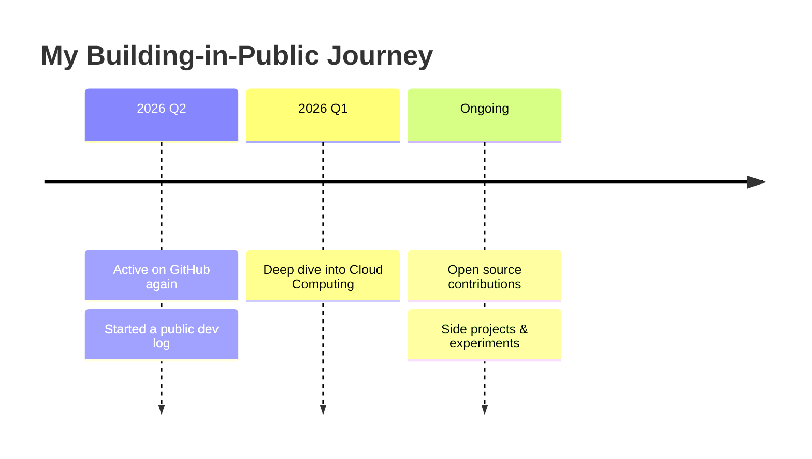

<h1 align="center">Hi there 👋 I'm Kumud Gupta</h1>
<h3 align="center">A passionate software developer • building in public</h3>

  
  

---

## 🧭 About Me

- 🔭 I'm currently **building & shipping projects in public**
- 🌱 I'm currently learning **Cloud Computing Technologies**
- ⚡ I log my work below as a running **project timeline / dev journal**
- 💬 Ask me about **ANYTHING ✌️**
- 📫 Reach me at **kumudgupta76@gmail.com**

---

## 🗓️ Project Timeline / Dev Log

> A running log of what I'm building, learning, and shipping. Newest first.

### 📌 2026

<!-- TIMELINE:START -->

- **`6 Jun 2026`** — 🚀 Pushed **1 commit** to **[kumudgupta76/kumudgupta76](https://github.com/kumudgupta76/kumudgupta76)**.
  - [`e768df3`](https://github.com/kumudgupta76/kumudgupta76/commit/e768df3b8cdfc73ff6a26971bd97e533f45a3cec) Add Commit Message to Timeline
- **`6 Jun 2026`** — 🚀 Pushed **1 commit** to **[kumudgupta76/kumudgupta76](https://github.com/kumudgupta76/kumudgupta76)**.
  - [`ee9afcc`](https://github.com/kumudgupta76/kumudgupta76/commit/ee9afccd1f1e91fac0ad042b46df84b7e4b3c0b1) Fix Timeline issue
- **`6 Jun 2026`** — 🚀 Pushed **1 commit** to **[kumudgupta76/kumudgupta76](https://github.com/kumudgupta76/kumudgupta76)**.
  - [`2c054af`](https://github.com/kumudgupta76/kumudgupta76/commit/2c054afb84eef8f4e98072bf47b6e561b3b1e7a7) Upgrade Profile Repo
- **`6 Jun 2026`** — 🚀 Pushed **1 commit** to **[kumudgupta76/my-buddy](https://github.com/kumudgupta76/my-buddy)**.
  - [`7a12f5a`](https://github.com/kumudgupta76/my-buddy/commit/7a12f5aab69f2dc2789844bf962fcd78c90a77bc) Invoive generator
- **`17 May 2026`** — 🚀 Pushed **1 commit** to **[kumudgupta76/my-buddy](https://github.com/kumudgupta76/my-buddy)**.
  - [`da3f3f9`](https://github.com/kumudgupta76/my-buddy/commit/da3f3f9d279d033c448f2b5d18090949e57b12c7) Updates
- **`17 May 2026`** — 🚀 Pushed **1 commit** to **[kumudgupta76/my-buddy](https://github.com/kumudgupta76/my-buddy)**.
  - [`b50b866`](https://github.com/kumudgupta76/my-buddy/commit/b50b86699019f046510a23d82d3a961838e2f458) Updates
- **`16 May 2026`** — 🚀 Pushed **1 commit** to **[kumudgupta76/my-buddy](https://github.com/kumudgupta76/my-buddy)**.
  - [`d19b604`](https://github.com/kumudgupta76/my-buddy/commit/d19b604dfd3d581c93664d0e9b82199f87eb701b) Updates
- **`16 May 2026`** — 🚀 Pushed **1 commit** to **[kumudgupta76/my-buddy](https://github.com/kumudgupta76/my-buddy)**.
  - [`1814e71`](https://github.com/kumudgupta76/my-buddy/commit/1814e712a353778a230483c54fb86013b49c0834) UI improvements
- **`15 May 2026`** — 🚀 Pushed **1 commit** to **[kumudgupta76/my-buddy](https://github.com/kumudgupta76/my-buddy)**.
  - [`e662a45`](https://github.com/kumudgupta76/my-buddy/commit/e662a45ef633d33e3ff5433afdd2ec062a7d1bbb) Updates
- **`15 May 2026`** — 🚀 Pushed **1 commit** to **[kumudgupta76/my-buddy](https://github.com/kumudgupta76/my-buddy)**.
  - [`94159f5`](https://github.com/kumudgupta76/my-buddy/commit/94159f5cb5799d46fa7fcd9ad3bafad96247fef4) new features
- **`8 May 2026`** — 🚀 Pushed **1 commit** to **[kumudgupta76/StreamAgenda](https://github.com/kumudgupta76/StreamAgenda)**.
  - [`5b08665`](https://github.com/kumudgupta76/StreamAgenda/commit/5b086654d2a3c8ce104813986e8e4456ffdb0081) Add button for presenting agenda in list mode

⏱️ Auto-updated on 2026-06-06 from my public GitHub activity.

<!-- TIMELINE:END -->

---

## 🔥 Currently Working On

| Project | What it is | Status |
| ------- | ---------- | ------ |
| _Add your project_ | _One-line description_ | 🟢 Active |
| _Add your project_ | _One-line description_ | 🟡 Planning |

---

## 🛠️ Tech I Work With

  

---

## 📊 GitHub Stats

  
  

  

  

---

## 🤝 Connect With Me

  
  
  
  

---

<i>⭐ This README doubles as my dev journal — check the timeline above to see what I'm shipping.</i>

